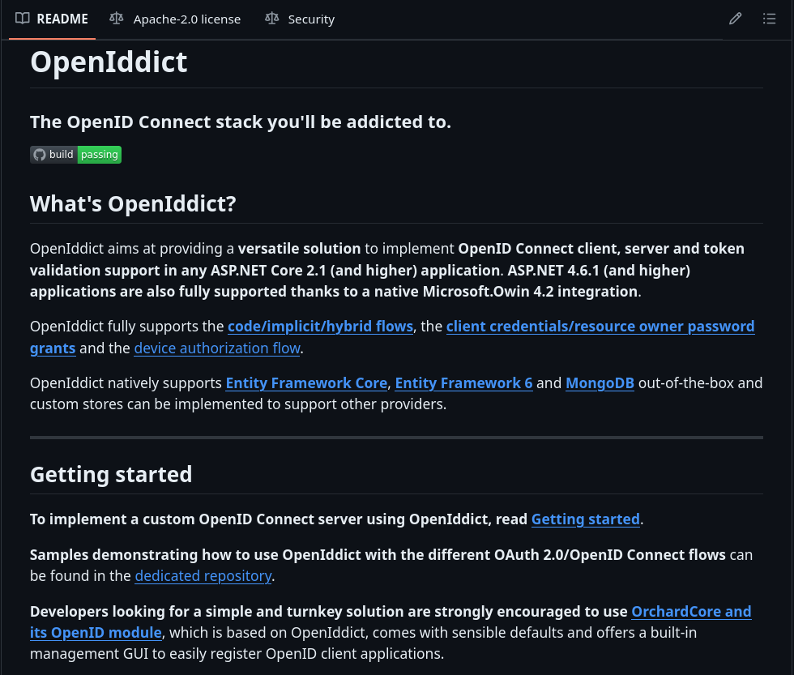

# OpenID Connect Authentication Client



---


https://github.com/openiddict/openiddict-core

## Most common turnkey solutions for OpenID Connect:

- Orchard Core OpenID module ([link](https://docs.orchardcore.net/en/latest/reference/modules/OpenId/)), ([source code](https://github.com/OrchardCMS/OrchardCore/blob/main/src/OrchardCore.Modules/OrchardCore.OpenId/))
- ABP Framework OpenIddict module ([link](https://abp.io/docs/latest/modules/openiddict)), ([source code](https://github.com/abpframework/abp/blob/dev/modules/openiddict/src/Volo.Abp.OpenIddict.AspNetCore/Volo/Abp/OpenIddict/))

And there are simple and clean sample from OpenIddict: [Velusia](https://github.com/openiddict/openiddict-samples/tree/dev/samples/Velusia)

## OpenId Connect Client Configuration

To configure an OpenID Connect client, you can use `AddOpenIdConnect` or `AddOpenIddict` extension methods.

examples:

**1 Using `AddOpenIdConnect`:**

```csharp
// TODO: AddOpenIdConnect
```

**1 Using `AddOpenIddict`:**

```csharp
// TODO: AddOpenIddict
```

And be sure to set the callback path (RedirectUri) and implement an authentication controller to handle the callback.
The authentication controller should map and store the user claims and sign in the user after the user is autherized by the identity provider.

### Authentication Controller Examples

- ABP Framework: https://github.com/abpframework/abp/blob/dev/modules/openiddict/src/Volo.Abp.OpenIddict.AspNetCore/Volo/Abp/OpenIddict/Controllers/AuthorizeController.cs
- Orchard Core: https://github.com/OrchardCMS/OrchardCore/blob/8380e35cb1086e0a33103a606faeb3ba6c8b83f8/src/OrchardCore.Modules/OrchardCore.OpenId/Controllers/AccessController.cs#L184 
- Velusia Sample: https://github.com/openiddict/openiddict-samples/blob/dev/samples/Velusia/Velusia.Client/Controllers/AuthenticationController.cs

### LocalUser vs ExternalUser

- LocalUser: User that is stored in the application database.
- ExternalUser: User that is stored in an external identity provider.

When a user signs in using an external identity provider, the application should map the external user to a local user.
The common is that the application try to find a local user with the same email address as the external user, if it exists, the application should map the external user to the local user. If it does not exist, the application should create a new local user and map the external user to the new local user.

## Velusia Sample

The Velusia sample authorization code flow demo, with an ASP.NET Core application acting as the client.

The sample contains Two projects:
- Velusia.Client
- Velusia.Server

To run the sample, you need to:
- Clone the samples repo: https://github.com/openiddict/openiddict-samples
- Run the Vsamples/Velusia/Velusia.Server project
- Run the samples/Velusia/Velusia.Client project

If you use visual studio, you can set multiple startup projects, and run both projects at the same time. and you can scope the visual studio explorer to show Velusia folder only.

## Helpful Links

- [Introducing the OpenIddict client](https://kevinchalet.com/2022/02/25/introducing-the-openiddict-client/)
- [Getting started with the OpenIddict web providers](https://kevinchalet.com/2022/12/16/getting-started-with-the-openiddict-web-providers/)
- [OpenIddict Documentation](https://documentation.openiddict.com/)
